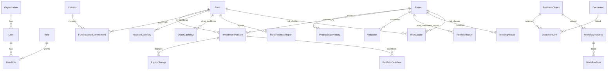

# PE/VC 投资管理系统数据模型草案

## 1. 建模原则

- 不复制目标产品数据库结构和字段名；使用业务领域模型重新设计。
- 项目、基金、投资人、投资关系、现金流、文档、流程是一级核心对象。
- 业务对象使用强模型，扩展字段使用配置化字段表。
- 所有对象必须具备权限、审计、附件和软删除能力。

## 2. 核心实体关系

## 3. 系统与权限

### tenant

用于 SaaS 或多空间隔离。

- id
- name
- status
- config_json
- created_at

### organization

- id
- tenant_id
- parent_id
- name
- sort_order
- status

### user

- id
- tenant_id
- organization_id
- display_name
- login_name
- email
- mobile
- password_hash
- status
- last_login_at

### role

- id
- tenant_id
- name
- description
- system_role_flag

### permission_policy

- id
- tenant_id
- role_id
- resource_type
- action
- data_scope
- field_rules_json

数据范围建议：

- all：全部。
- organization：本部门及下级。
- owner：本人负责。
- participant：本人参与。
- custom：自定义条件。

### audit_log

- id
- tenant_id
- actor_user_id
- action
- object_type
- object_id
- before_json
- after_json
- ip
- user_agent
- created_at

## 4. 项目管理

### project

对应项目池/被投企业/投资机会。

- id
- tenant_id
- short_name
- full_name
- credit_code
- status
- entry_at
- owner_user_id
- city
- founded_on
- industry
- registered_address
- description
- highlights
- main_products
- other_notes
- source
- deleted_at

建议状态：

- 入库
- 立项
- TS
- 尽调
- 内审
- 项目投决
- 投资协议
- 打款
- 投后服务
- 部分退出
- 完全退出
- 终止

### project_stage_history

- id
- project_id
- from_status
- to_status
- changed_by
- reason
- changed_at

### project_member

- id
- project_id
- user_id
- role_type

## 5. 基金管理

### fund

- id
- tenant_id
- short_name
- full_name
- product_code
- status
- fundraising_method
- registered_capital
- nav_amount
- unit_nav
- custody_status
- investor_count_text
- entity_type
- credit_code
- organization_form
- fund_type
- owner_user_id
- manager_org_id
- gp_org_id
- executive_partner
- amac_filing_status
- amac_filing_no
- target_size
- currency
- committed_amount
- paid_in_amount
- exchange_rate
- investment_strategy
- investment_fields
- investment_restrictions
- created_at
- deleted_at

建议状态：

- 募集期
- 投资期
- 管理期
- 退出期
- 延长期
- 清算/结束

### fund_term

- id
- fund_id
- investment_period_years
- investment_start_on
- investment_end_on
- exit_period_years
- exit_start_on
- exit_end_on
- extension_years
- extension_count
- is_extended
- extension_start_on
- extension_end_on
- business_start_on
- business_expire_on
- fund_start_on
- fund_expire_on
- filing_on
- lpa_first_signed_on
- lpa_latest_signed_on

### fund_fee_term

- id
- fund_id
- term_type
- investment_base
- investment_fee_rate
- exit_base
- exit_fee_rate
- extension_base
- extension_fee_rate
- fee_note

### fund_distribution_term

- id
- fund_id
- distribution_principle
- distribution_frequency
- has_hurdle
- hurdle_rate
- has_carry
- carry_rate

### fund_governance

- id
- fund_id
- committee_member_count
- committee_composition
- voting_rule
- key_person_count
- key_person_composition
- key_person_lockup
- key_person_replacement_rule
- observer_count
- observer_composition

### fund_disclosure_term

- id
- fund_id
- annual_report_types_json
- annual_disclosure_requirement
- quarterly_report_types_json
- meeting_requirement
- audit_arrangement
- related_party_control

## 6. 投资关系与组合

### investment_position

基金对项目的投资关系。

- id
- tenant_id
- fund_id
- project_id
- agreement_amount
- first_investment_on
- total_paid_amount
- remaining_cost
- initial_share_percent
- latest_share_percent
- latest_valuation
- total_returned_amount
- total_exit_cost
- total_exit_profit
- total_dividend
- first_return_on
- latest_return_on
- full_exit_on
- exit_method
- exit_status

### equity_change

- id
- investment_position_id
- project_id
- fund_id
- change_reason
- agreement_on
- investment_committee_approved_on
- round_name
- lead_investor_flag
- investment_method
- share_before
- share_after
- other_institutions_text

### valuation

- id
- project_id
- fund_id
- valuation_on
- valuation_method
- valuation_amount
- source
- note

## 7. 现金流

### investor_cashflow

投资人维度的基金现金流。

- id
- fund_id
- investor_id
- cashflow_type
- amount
- currency
- occurred_on
- note

类型示例：

- 认缴
- 实缴
- 退投资款
- 分配本金
- 分配收益
- 转让
- 利息

### portfolio_cashflow

基金到项目的现金流。

- id
- fund_id
- project_id
- investment_position_id
- cashflow_type
- amount
- currency
- occurred_on
- note

类型示例：

- 投资本金
- 收回本金
- 分红
- 收益
- 可转债本金
- 可转债利息

### other_cashflow

- id
- fund_id
- cashflow_type
- amount
- currency
- occurred_on
- counterparty
- note

## 8. 投资人和管理机构

### investor

- id
- tenant_id
- name
- type
- contact_name
- contact_email
- contact_phone
- status
- note

### fund_investor_commitment

- id
- fund_id
- investor_id
- committed_amount
- paid_in_amount
- commitment_percent
- signed_on
- status

### management_org

- id
- tenant_id
- name
- org_type
- credit_code
- contact_name
- contact_email
- note

## 9. 投后数据

### portfolio_report

- id
- project_id
- period
- revenue
- net_profit
- cash_balance
- headcount
- valuation
- report_status
- submitted_by
- submitted_at
- source

### data_collection_campaign

- id
- tenant_id
- name
- period
- target_type
- status
- due_on
- created_by

### data_collection_target

- id
- campaign_id
- project_id
- recipient_email
- status
- sent_at
- submitted_at
- token_hash

## 10. 会议、日程和公告

### calendar_event

- id
- tenant_id
- title
- event_type
- all_day
- starts_at
- ends_at
- related_object_type
- related_object_id
- owner_user_id

### meeting_minute

- id
- tenant_id
- project_id
- title
- status
- attendees_text
- meeting_at
- agenda_summary
- decision_result
- discussion_points
- next_steps
- note
- ai_parse_status

### announcement

- id
- tenant_id
- title
- content
- published_at
- created_by

## 11. 风险管理

### risk_clause

- id
- tenant_id
- fund_id
- project_id
- round_name
- status
- clause_type
- clause_content
- remind_on
- owner_user_id
- closed_at

### incident_risk

- id
- tenant_id
- project_id
- title
- level
- status
- occurred_on
- description
- mitigation
- owner_user_id

## 12. 文档

### document

- id
- tenant_id
- file_name
- storage_key
- mime_type
- size_bytes
- checksum
- version_no
- owner_user_id
- permission_level
- deleted_at

### document_link

- id
- document_id
- object_type
- object_id
- category

### document_permission

- id
- document_id
- principal_type
- principal_id
- can_view
- can_download
- can_edit
- can_delete

## 13. 流程

### workflow_template

- id
- tenant_id
- name
- category
- related_object_type
- status
- definition_json

### workflow_instance

- id
- tenant_id
- template_id
- title
- related_object_type
- related_object_id
- initiator_user_id
- status
- started_at
- completed_at

### workflow_task

- id
- instance_id
- node_key
- assignee_user_id
- status
- action
- comment
- created_at
- completed_at

### workflow_attachment

- id
- instance_id
- document_id

## 14. AI 与知识库

### research_note

- id
- tenant_id
- title
- content
- source_type
- tags_json
- created_by

### ai_parse_job

- id
- tenant_id
- object_type
- object_id
- document_id
- job_type
- status
- result_json
- reviewed_by
- reviewed_at

AI 结果必须人工确认后写入业务字段。

## 15. 配置化扩展

### custom_field

- id
- tenant_id
- object_type
- field_key
- label
- field_type
- options_json
- required_flag
- visible_flag
- sort_order

### custom_field_value

- id
- tenant_id
- object_type
- object_id
- field_key
- value_json

### saved_view

- id
- tenant_id
- user_id
- object_type
- name
- filters_json
- columns_json
- sort_json

## 16. 关键索引

- `project(tenant_id, status, owner_user_id)`
- `fund(tenant_id, status, owner_user_id)`
- `investment_position(fund_id, project_id)`
- `portfolio_cashflow(fund_id, project_id, occurred_on)`
- `investor_cashflow(fund_id, investor_id, occurred_on)`
- `document_link(object_type, object_id)`
- `workflow_instance(related_object_type, related_object_id, status)`
- `audit_log(tenant_id, object_type, object_id, created_at)`

## 17. 权限验收要点

- 用户不能看到无权限项目、基金、文件、流程。
- 列表导出必须沿用当前筛选和权限范围。
- 文件预览、下载、删除独立授权。
- 高敏字段支持字段级隐藏。
- 所有批量操作、导入、导出、下载必须留审计。
